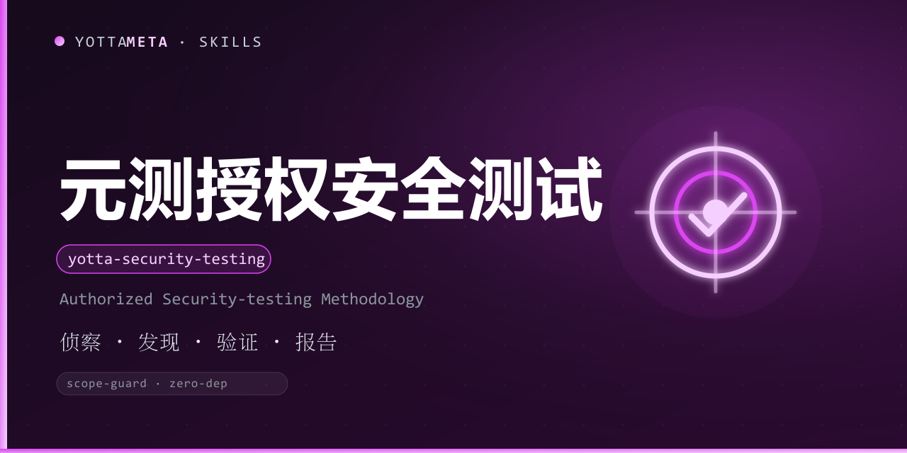

<p align="center"><b>Language</b>: <a href="./README.md">English</a> · 中文</p>

<p align="center">
  
</p>

<h1 align="center">yotta-security-testing · 元测 (YuanCe)</h1>

<p align="center">YottaMeta 的 <b>有纪律、授权优先的 AI 安全测试方法论</b>：按
<b>侦察 → 发现 → 验证 → 报告</b> 四阶段，对<b>已授权目标</b>（自有资产 / SRC 众测·bug bounty 授权范围 /
CTF·靶场 / 本地靶机）做 Web 安全测试；内置 <b>Scope Guard</b>，把「仅限授权」做成硬机制而不是一句免责声明。</p>
<p align="center">触发场景：用户要求对已授权目标做安全测试 / 渗透测试 / 漏洞评估、挖 SRC 众测或 bug bounty、
做 CTF 或靶场（DVWA / OWASP Juice Shop / HTB / VulnHub）演练、生成漏洞评估与渗透测试报告；
或说 元测 / 安全测试 / 渗透 / 挖洞 / 挖 SRC / 授权测试 / scope check 等。</p>
<p align="center">零外部依赖（Python 3.8+ 标准库）；Windows + Linux + macOS；
定位 = 方法论 / 教材 —— <b>不输出可执行 payload</b>。</p>

<p align="center">
  <a href="LICENSE"></a>
  <a href="https://agentskills.io/"></a>
  <a href="https://www.npmjs.com/package/@yottameta/yotta-security-testing"></a>
  <a href="https://github.com/YottaMeta/yotta-security-testing"></a>
  <a href="https://github.com/YottaMeta/yotta-security-testing/commits/main"></a>
  <a href="https://github.com/YottaMeta/yotta-security-testing"></a>
</p>

## 这是什么

元测是一个**授权安全测试工作流**技能：不是漏洞扫描器、不是靶场技能、更**不是攻击工具**。它教智能体在
「你**有权**测试的目标」上按四个有纪律的阶段做 Web 安全测试，并用硬机制强制授权边界，让
**未授权目标默认被拒绝**。

技能市场到处是「直接复制这条 payload 去打」的合集；元测正好相反——它教的是「怎么测一个你被允许测的目标」：
怎么划范围、怎么发现与验证问题、怎么写一份可复现的报告、怎么在授权边界内（SRC 平台规则 / CTF 规则 /
自有资产）做事而不越界。

## Scope Guard 五道防线（硬产品机制，非口头免责）

1. **范围守卫（Scope Guard）**：任何目标操作前必须确认目标在授权范围内；CLI `scope check <target>` 双保险，
   未授权目标默认拒绝（非 0 退出码 + 明确报错）。
2. **默认指向合法环境**：教程与 playbook 覆盖本地靶场 / CTF（DVWA、OWASP Juice Shop、HTB、VulnHub）
   以及**已授权真实目标 / SRC 众测**；真实目标必须先按平台授权范围在 scope.json 登记。
3. **授权声明机制**：`scope init` 声明授权类型与范围，写入 `~/.yottasec/scope.json`
   （或项目级 `.yottasec/scope.json`）；授权以 scope.json 为准，不信任对话口头声明。
4. **法律红线声明**：仅限授权测试，使用者自负法律责任；适用中国《网络安全法》《刑法》第 285 / 286 条红线。
   定位 = 方法论 / 教材。
5. **操作留痕**：每次测试记录目标 / 动作 / 时间 → `~/.yottasec/audit.log`（JSONL，默认开启，不可静默关闭）。

## 四阶段方法论（贯穿所有 playbook）

| 阶段 | 产出 | 说明 |
|---|---|---|
| 侦察 Reconnaissance | 资产清单 | 只读收集授权范围内的目标信息：应用入口、技术栈、功能清单、输入面 |
| 发现 Discovery | 测试点清单 | 按 playbook 枚举输入点与测试点，记录候选漏洞假设 |
| 验证 Verification | 验证记录 | 最小化验证（「类」表述，不给可复制注入串），确认漏洞与影响 |
| 报告 Reporting | 报告草稿 | 按报告模板沉淀目标 / 时间 / 发现 / 证据 / 修复建议，敏感凭据脱敏 |

目标 / 动作变化时都要重新 `scope check`。SRC / 真实目标：每轮只测平台授权范围内的资产，
一旦发现真实用户数据即停手并最小化证据。

## Playbook 索引

| # | playbook | 覆盖 | 对应 OWASP 2021 |
|---|---|---|---|
| 00 | 漏洞评估与渗透报告方法论 | 四阶段 + 报告模板 + SRC 实战 | 全流程 |
| 01 | SQL 注入测试（SQLi） | 注入类漏洞 | A03 Injection |
| 02 | XSS 跨站脚本 | 客户端脚本注入 | A03 Injection |
| 03 | SSRF 服务端请求伪造 | 服务端请求伪造 | A10 SSRF |
| 04 | XXE 外部实体 | XML 外部实体 | A05 Security Misconfiguration |
| 05 | 反序列化 | 不安全反序列化 | A08 Software & Data Integrity |
| 06 | 鉴权与访问控制 | 认证缺陷 / 越权 | A01 / A07 Broken Access Control |
| 07 | API 安全 | API 攻击面 | OWASP API Top 10 映射 |
| 08 | 命令注入（Command Injection） | 系统命令拼接 | A03 Injection |
| 09 | 文件上传（File Upload） | 上传校验绕过 | A05 Security Misconfiguration |
| 10 | 业务逻辑漏洞 | 参数篡改 / 步骤跳跃 / 并发 | A01 / A04 |
| 11 | 敏感信息泄露 | 备份/源码/报错/响应头 | A05 Security Misconfiguration |
| 12 | 不安全配置 | 安全头 / CORS / 默认配置 | A05 Security Misconfiguration |

每个 playbook 都含固定六节：目标识别与确认 → 检测思路 → 验证方法 → 防御视角 → 实战演练
（靶场 / 授权目标 / SRC）→ 留痕与报告；靶场关卡与真实授权场景都能套用。

## 命令一览

| 命令 | 说明 |
|---|---|
| scope init | 初始化授权清单（默认 deny） |
| scope add | 添加授权目标（`--type` = self-owned / ctf / bug-bounty / training / explicit） |
| scope check | 目标三层判定：授权白名单 → 类型识别 → 默认拒绝 |
| scope list / remove | 查看 / 移除授权条目 |
| report generate | 由 findings.json 生成漏洞评估 / 渗透测试报告（Markdown / JSON，敏感凭据脱敏） |
| audit log | 查看 / 过滤 / 导出操作留痕（默认开启） |
| --version | 显示版本 |

## 使用示例

Windows 用 python，Linux/macOS 用 python3。

```bash
# 1) 初始化授权清单（默认 deny，必须先声明授权范围）
python3 scripts/yotta_security_testing.py scope init --owner <你>

# 2) 添加授权目标（本地靶场 / CTF / bug bounty / 自有资产 / 显式授权）
python3 scripts/yotta_security_testing.py scope add --type ctf --target 127.0.0.1 --note dvwa
python3 scripts/yotta_security_testing.py scope add --type bug-bounty --target api.example.com --note "SRC 授权范围（以平台页面为准）"
python3 scripts/yotta_security_testing.py scope add --type self-owned --target example.com --scope "*.example.com" --expires 2027-12-31

# 3) 目标判定：放行（exit 0）/ 未授权拒绝（exit 1）/ 绝对禁止（exit 2）
python3 scripts/yotta_security_testing.py scope check http://127.0.0.1/dvwa
python3 scripts/yotta_security_testing.py scope check api.example.com --json

# 4) 生成漏洞评估报告（由 findings.json，敏感凭据自动脱敏）
python3 scripts/yotta_security_testing.py report generate findings.json --out report.md

# 5) 操作留痕（默认开启）：查看 / 过滤 / 导出
python3 scripts/yotta_security_testing.py audit log --result deny
python3 scripts/yotta_security_testing.py audit log --export audit-deny.jsonl
```

退出码：**0** = 放行；**1** = 未授权（默认拒绝）；**2** = 绝对禁止（云元数据端点等）。

## 安装

以下四种方式任选，顺序即推荐优先级；技能文件一律从 **npm** 获取（GitHub 无代理较慢，npm 支持镜像）。

### 方式一：npm 一行装（推荐）

```text
# 可选国内加速：npm config set registry https://registry.npmmirror.com
npx -y @yottameta/yotta-security-testing --agent <智能体名称>      # 装到指定智能体默认用户级技能目录
npx -y @yottameta/yotta-security-testing --dir <智能体的技能目录>  # 指到技能目录本身（如 ~/.codex/skills）
```

- `--agent <name>` 自动装到该智能体默认用户级目录；`--list` 可查看各智能体默认目录。
- `--dir <路径>` 装到指定的技能目录；未收录的智能体用 `--dir` 指到它的技能目录。
- npmmirror 未同步新包（404）：加 `--registry=https://registry.npmjs.org/`（国内需代理），或稍等镜像缓存。

### 方式二：git clone（开发者 / 有 git 环境）

```text
git clone https://github.com/YottaMeta/yotta-security-testing.git <智能体的技能目录>/yotta-security-testing
```

### 方式三：GitHub 下载压缩包（手动 / 无 git 环境）

在 GitHub 仓库 `YottaMeta/yotta-security-testing` 点 **Code → Download ZIP**，解压后把
`yotta-security-testing` 文件夹放进智能体技能目录。

### 方式四：install.sh（多智能体一键脚本）

```text
bash install.sh --agent <name>   # 装到指定智能体默认用户级目录
bash install.sh --dir <path>     # 装到指定目录
bash install.sh --list           # 列出智能体 -> 默认目录
```

> 方式一走 npm 源（npmmirror / npmjs），不依赖 GitHub；方式二 / 三走 GitHub，国内无代理可能失败。

## 开发与校验

技能包自带测试脚本（随发布包一起分发）：

```bash
# 在技能目录内跑全量用例（444 个）
python scripts/test_yotta_security_testing.py
```

参考资料：`references/tutorial.md`（中文教程，新手全流程，含 SRC 实战）、
`references/report-template.md`（报告模板，findings schema）、`playbooks/00-methodology.md`（方法论）。

## 许可证

MIT © YottaMeta —— 见 [LICENSE](./LICENSE)。